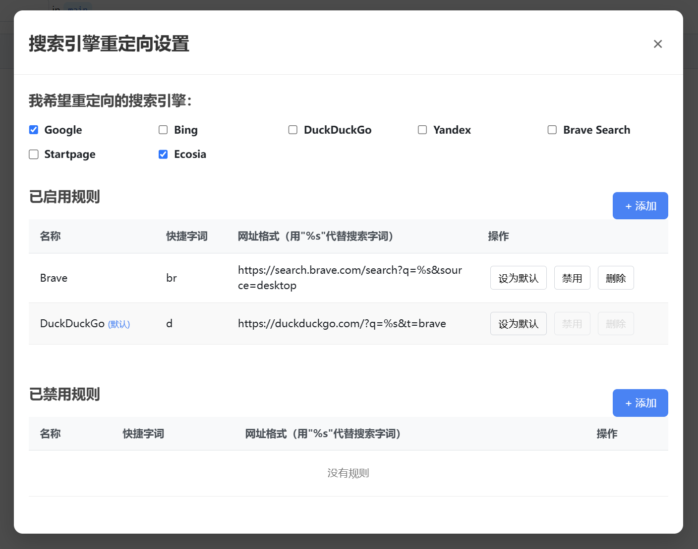

# 搜索引擎重定向 & 管理油猴脚本

一个 [TamperMonkey](https://www.tampermonkey.net/) 脚本，帮助你从一个搜索引擎重定向到另一个搜索引擎

🌟 [点击这里从 GreasyFork 安装脚本](https://greasyfork.org/zh-CN/scripts/537732-search-engine-redirector-search-engine-manager)

**安装完毕后请在油猴扩展的菜单中找到本脚本，然后配置重定向规则** ⬇️

## 有什么用？

**场景 1**：在 Google Chrome 和其它浏览器中，搜索引擎设置为 Google 时，能够为你提供搜索关键词预测，就像下面这样：

然而，当你在设置中自定义一个其他搜索引擎，这个时候，「搜索关键词预测」往往不起作用！😥

这个时候，你可以将默认搜索引擎设置为 Google 来为你提供搜索关键词预测，然后使用本脚本，自动重定向到其他你喜欢的搜索引擎！🥰

**场景 2**：使用 Windows 任务栏上的搜索功能时，默认的搜索引擎是 Bing，而且微软不允许你更改！😥

这个时候，使用此脚本，将 Bing 重定向到其他你喜欢的搜索引擎！🥰